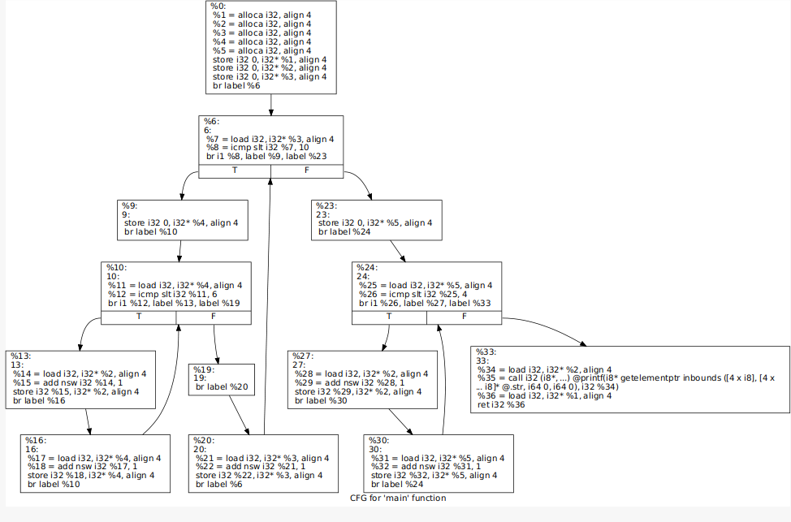

# SimpleLLVM_Pass
LLVM Passes perform the transformations and optimizations that make up the compiler, they build the analysis results that are used by these transformations, and they are, above all, a structuring technique for compiler code.

This pass is designed to simply print out the name of non-external functions that exist in the program being compiled. It does not modify the program at all, it just inspects it and count the number of times that each opcode appears in a given function .
## Build
```
mkdir build && cd build
cmake ../
make
```
## Test
1- generate bytecode from source file
```bash
clang -emit-llvm test.c -c -o test.bc
```
2- run the pass on it
```bash
opt -load-pass-plugin=./build/LLVMPassSample/libHelloNewPMPass.so -passes="hello-new-pm-pass" -S test.bc -o=test.ll
```
## Example :
* HelloPass :
  * Source file :
```C
#include <stdio.h>
int foo(int a,int b) {
  return b+a;
}
int goo(int a,int b) {
  return b-a;
}
int main() {
  int a,b;
  a=foo(3,4);
  b=goo(3,4);
  a = a/b;
  return a;
}
```
  * result :
```
Function : foo
 add: 1
 alloca: 2
 load: 2
 ret: 1
 store: 2
Function : goo
 alloca: 2
 load: 2
 ret: 1
 store: 2
 sub: 1
Function : main
 alloca: 3
 call: 2
 load: 3
 ret: 1
 sdiv: 1
 store: 4
```
* CountLoopPass :
  + Source file :
```C
#include <stdio.h>
int main() {
	int t=0;
	for(int i=0;i<10;i++) {
		for(int  j=0;j<6;j++)	{
			t++;
		}
	}
	for(int i=0;i<4;i++) {
		t++;
	}
	printf("%d\n",t);
}
```
  + CFG :

  + result :
```
Function : main
LoopLevel : 0 Block : 7
LoopLevel : 1 Block : 3
LoopLevel : 0 Block : 3
```
